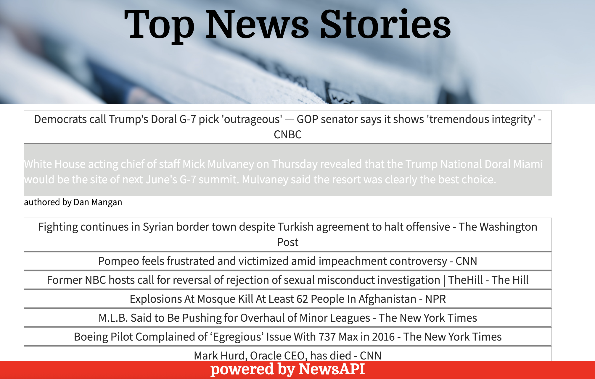

# UI Element

## **Goal**

The goal of this project was to create a site with a user interface accordion pattern that brings in data from a news API.

## **Languages**

HTML, CSS, JavaScript

## **Download**

To download this project, fork and clone the repository. Open in your browser to read the latest news for today! Or check out the deployed version at [Top Stories](https://torykling.github.io/Project3/)!

## **Challenges**

This API had some array items with missing data. I had to build a for loop to prevent a title from displaying if its description was an empty string and to prevent the author from displaying if its author was null.
I added a search feature to allow the user to search for articles by category. Sometimes the search returns articles that are not particularly relevant to the search. Also, the formatting of content from the API is inconsitent from one article to the next. I'm not sure if the API allows for a way to address these issues.

## **Updates**

I added a link in the title, so the user can navigate back to top stories after searching for articles by category. I also added a hover class to the accordion buttons to make the use of the buttons more intuitive.

## **Contribute**

- Source code: https://github.com/torykling/Project3/
- Issues: https://github.com/torykling/Project3/issues
